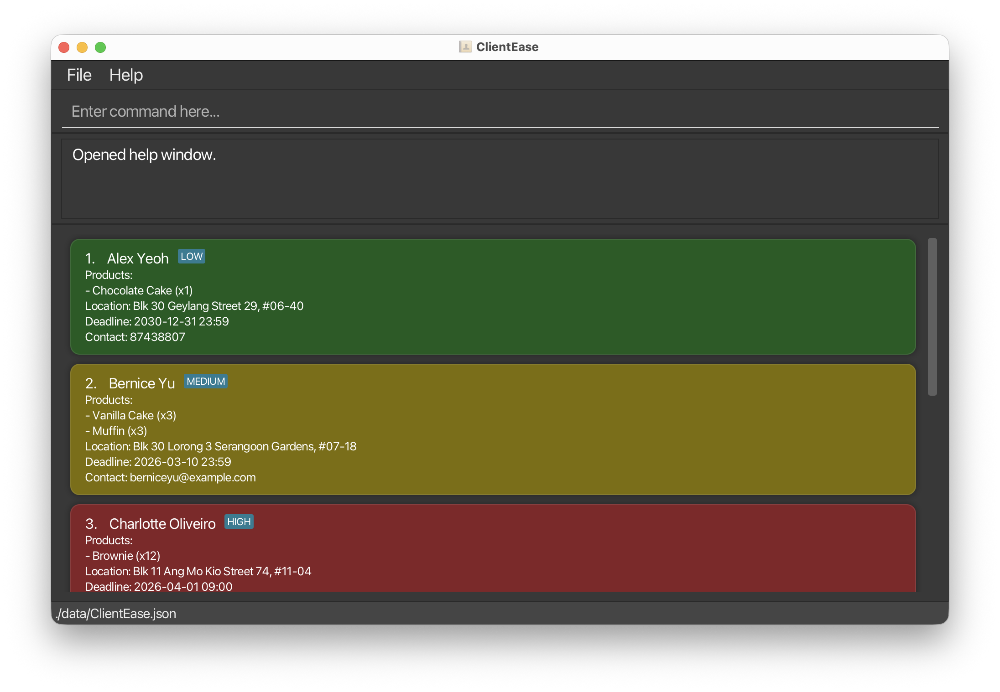
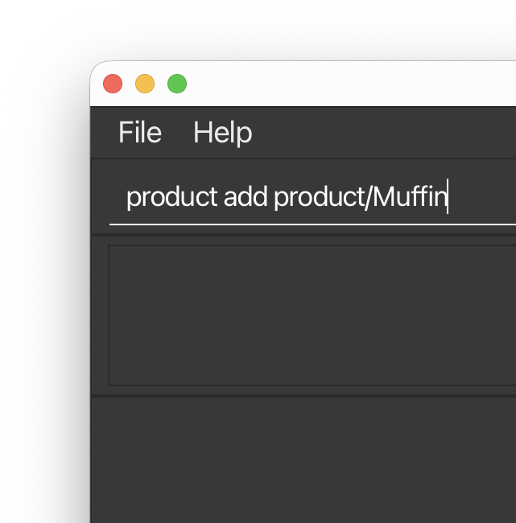
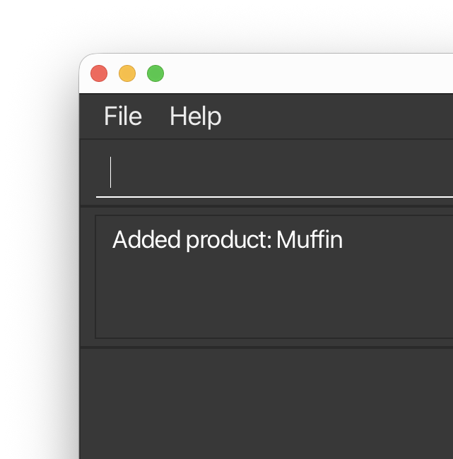
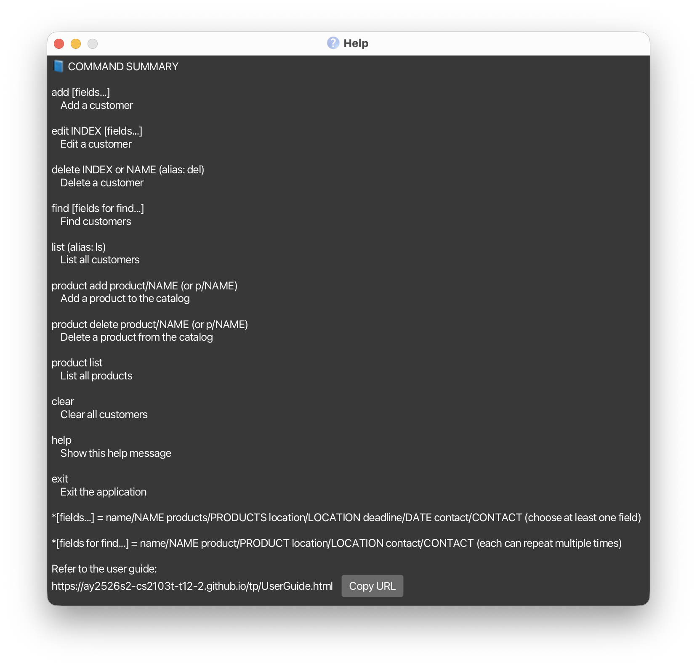
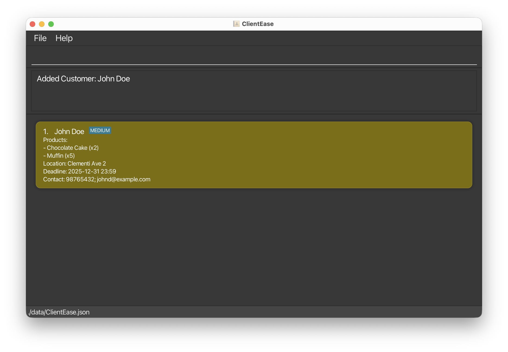
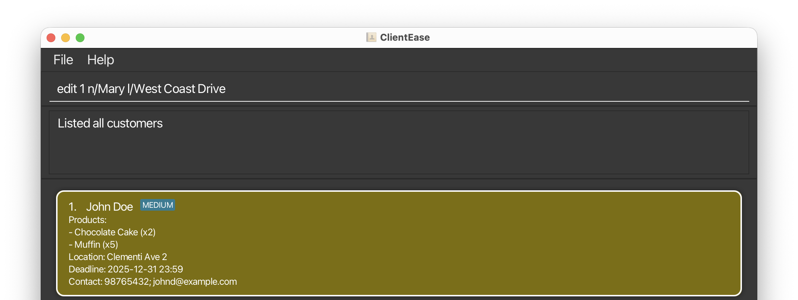
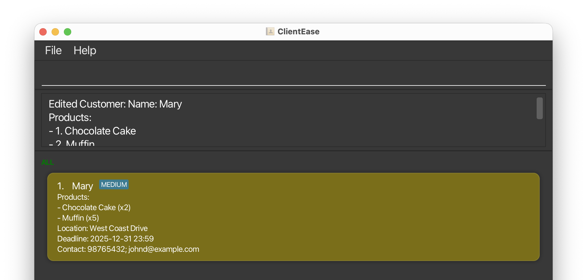
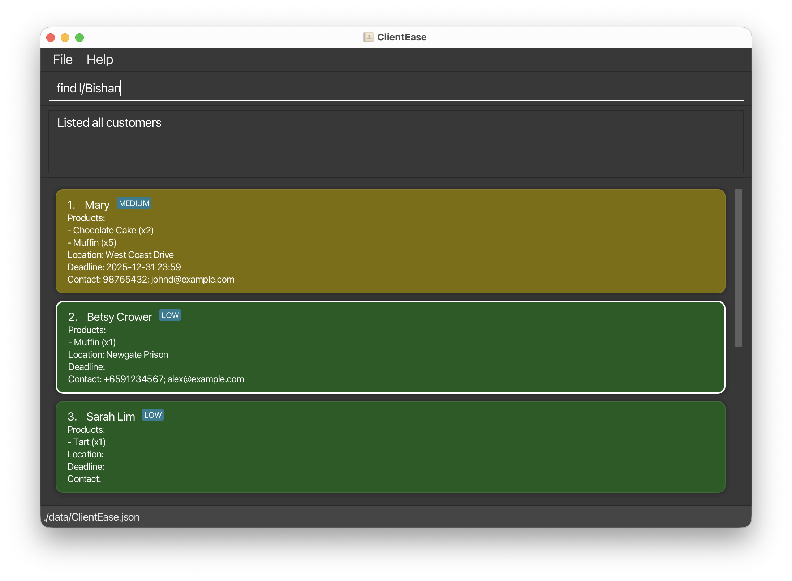
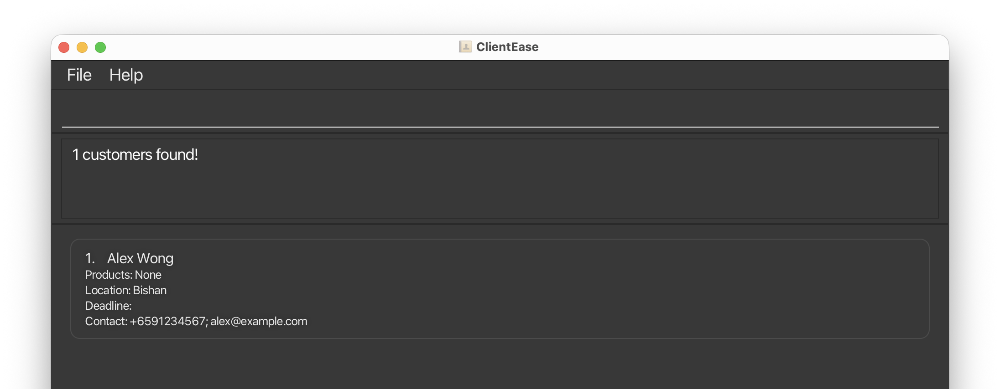

# ClientEase User Guide

**Version 1.0**

---

**ClientEase** is a lightweight customer contact manager designed for home-based online business owners who manage a small to medium customer base, perform frequent daily updates to customer contact information, and prefer fast, keyboard-driven text input.

Instead of clicking through multiple menus, ClientEase lets you type short commands to add customers, search by fields, track products and deadlines, and retrieve information instantly.

> 📝 **NOTE:** **Scenario:** You run a home bakery and receive orders through chat and email. Throughout the day you need to update phone numbers, delivery locations, and due dates quickly while keeping a clear view of open orders. ClientEase lets you do those updates in seconds with short commands, without switching between multiple windows.

- If you are new to ClientEase, start with **[Section 2: Quick Start](#2-quick-start)**.
- If you are looking for a specific command, jump to **[Section 9: Command Summary](#9-command-summary)**.
- If you are a developer, refer to the **Developer Guide**.

---

## Table of Contents

1. [Who Is This Guide For?](#1-who-is-this-guide-for)
2. [Quick Start](#2-quick-start)
   - [2.1 Installation (Windows)](#21-installation-windows)
   - [2.2 Installation (macOS)](#22-installation-macos)
   - [2.3 Installation (Linux)](#23-installation-linux)
   - [2.4 Overview of the Interface](#24-overview-of-the-interface)
3. [Understanding Command Format](#3-understanding-command-format)
   - [3.1 Notation Conventions](#31-notation-conventions)
   - [3.2 Parameter Reference (Full and Short Prefixes)](#32-parameter-reference-full-and-short-prefixes)
   - [3.3 Data Normalisation](#33-data-normalisation)
   - [3.4 Your First Commands](#34-your-first-commands)
4. [Managing Products](#4-managing-products)
   - [4.1 Add a Product](#41-add-a-product)
   - [4.2 Delete a Product](#42-delete-a-product)
   - [4.3 List All Products](#43-list-all-products)
5. [Managing Customers](#5-managing-customers)
   - [5.1 View Help](#51-view-help)
   - [5.2 Add a Customer](#52-add-a-customer)
   - [5.3 List All Customers](#53-list-all-customers)
   - [5.4 Edit a Customer](#54-edit-a-customer)
   - [5.5 Find Customers](#55-find-customers)
   - [5.6 Delete a Customer](#56-delete-a-customer)
   - [5.7 Clear All Customers](#57-clear-all-customers)
   - [5.8 Exit the App](#58-exit-the-app)
6. [Saving and Backing Up Data](#6-saving-and-backing-up-data)
7. [Frequently Asked Questions](#7-frequently-asked-questions)
8. [Known Issues](#8-known-issues)
9. [Command Summary](#9-command-summary)
10. [Glossary](#10-glossary)

---

## 1. Who Is This Guide For?

ClientEase is built for **home-based online business owners** who:

- Manage a **small to medium customer base** (typically under a few hundred contacts).
- Perform **frequent daily updates** to customer information, such as new orders, contact changes, or delivery deadlines.
- Prefer **keyboard-driven workflows** over clicking through menus.

### What You Need to Know

| Skill | What It Means in Practice |
|-------|--------------------------|
| Opening a programme | You can find and double-click a file, or follow step-by-step instructions to open a programme from a command window (explained in Section 2). |
| Typing structured commands | You can type instructions like `add name/John Doe contact/98765432` into a text box and press **Enter**. |
| Reading on-screen feedback | You can interpret short success or error messages shown in the app. |
| Basic file awareness | You understand that your data is stored in a file on your computer, and you know how to copy files for backup. |

> 📝 **NOTE:** Not sure if ClientEase is right for you? If you manage more than a few hundred customers with complex team workflows, you may benefit from a full-scale customer relationship management (CRM) system instead.

> 💡 **TIP:** ClientEase supports both **full-length prefixes** (e.g. `name/`) and **short prefixes** (e.g. `n/`) for every command. New users may find the full-length versions easier to remember, while experienced users can save keystrokes with the short versions. Both are shown side by side throughout this guide.

---

## 2. Quick Start

Follow these steps to install and start using ClientEase. Choose the instructions that match your operating system.

### 2.1 Installation (Windows)

**Step 1:** Check that you have **Java 17 or above** installed.

- Press **Win + R**, type `cmd`, and press **Enter** to open the Command Prompt.
- Type the following and press **Enter**:

```
java -version
```

- If you see a version number of 17 or higher (e.g. `17.0.2`), you are ready. If not, download Java 17 from [https://adoptium.net](https://adoptium.net) and install it.

**Step 2:** Download the latest `ClientEase.jar` file from the releases page.

**Step 3:** Create a folder for ClientEase (e.g. `C:\ClientEase`) and move the downloaded file into it.

**Step 4:** Open the Command Prompt again and navigate to your folder:

```
cd C:\ClientEase
```

**Step 5:** Start the application:

```
java -jar ClientEase.jar
```

> 💡 **TIP:** ClientEase launches with sample customer data so you can explore right away.

### 2.2 Installation (macOS)

**Step 1:** Check that you have **Java 17 or above** installed.

- Open **Terminal** (search for "Terminal" in Spotlight with **Cmd + Space**).
- Type the following and press **Return**:

```
java -version
```

- If you see version 17 or higher, you are ready. Otherwise, download from [https://adoptium.net](https://adoptium.net).
- Mac users: ensure you have the precise JDK version prescribed in the course requirements.

**Step 2:** Download the latest `ClientEase.jar` from the releases page.

**Step 3:** Create a folder (e.g. `~/ClientEase`) and move the file into it.

**Step 4:** In Terminal, navigate to the folder:

```
cd ~/ClientEase
```

**Step 5:** Start the application:

```
java -jar ClientEase.jar
```

### 2.3 Installation (Linux)

**Step 1:** Check that you have **Java 17 or above** installed.

- Open a terminal window.
- Type the following and press **Enter**:

```
java -version
```

- If the version is below 17 or Java is not found, install it:

```
sudo apt install openjdk-17-jdk
```

**Step 2:** Download `ClientEase.jar` from the releases page.

**Step 3:** Create a folder and move the file into it:

```
mkdir ~/ClientEase && mv ~/Downloads/ClientEase.jar ~/ClientEase/
```

**Step 4:** Navigate to the folder and start:

```
cd ~/ClientEase
java -jar ClientEase.jar
```

### 2.4 Overview of the Interface



*Figure 1: ClientEase main window showing all five functional areas*

| Area | Purpose |
|------|---------|
| 1. Command Box (top) | Where you type your commands and press **Enter** to run them. |
| 2. Result Display | Shows success messages or error feedback after each command. |
| 3. Customer List Panel | Displays all customers. Cards are colour-coded by **Priority Level** (Green/Yellow/Red) based on total product quantity. |
| 4. Priority Badge | A small tag (`LOW`, `MEDIUM`, `HIGH`) shown next to the name when the customer has products. |
| 5. Status Bar (bottom) | Shows the data file save location. |

#### Priority Colour Coding

| Colour | Priority | Total Product Quantity |
|--------|----------|----------------------|
| Green | Low | 1 to 5 items |
| Yellow | Medium | 6 to 10 items |
| Red | High | 11 or more items |

> 📝 **NOTE:** No priority tag is shown if the customer has no products.

---

## 3. Understanding Command Format

*Read this section before using any command.*

### 3.1 Notation Conventions

| Convention | Meaning | Example |
|-----------|---------|---------|
| `UPPER_CASE` | A placeholder you replace with your own value. | `name/NAME` becomes `name/John Doe` |
| `[square brackets]` | The parameter is optional. | `[contact/CONTACT]` means you may omit the contact. |
| Any order | Parameters can be typed in any order. | `add name/John contact/123` and `add contact/123 name/John` are identical. |
| Extra text ignored | Commands with no parameters (e.g. `help`, `list`, `exit`) ignore any text typed after them. | `help me` works the same as `help`. |

> 📝 **NOTE:** If you are copying commands from a PDF, be careful with multi-line examples. Line breaks may cause missing spaces. Always type the full command on **one line**.

### 3.2 Parameter Reference (Full and Short Prefixes)

Every parameter has a **full prefix** (easier to remember) and a **short prefix** (faster to type). Both work identically in all commands.

| Full Prefix | Short | Parameter | Required? | Details |
|------------|-------|-----------|-----------|---------|
| `name/` | `n/` | NAME | Yes (for add) | 1 to 100 characters. Only ASCII letters (A-Z, a-z), spaces, full stops (.), apostrophes ('), and hyphens (-). Must contain at least one letter. Names are unique (case-insensitive, extra spaces collapsed). |
| `products/` | `p/` | PRODUCTS | No | Comma-separated list of product names from the catalogue. Quantities use a colon (e.g. `Muffin:3`); defaults to 1 if omitted. Max 10,000 per product, 100,000 total. Duplicate names are allowed; quantities are summed. Products must exist in the catalogue first (see [Section 4](#4-managing-products)). |
| `location/` | `l/` | LOCATION | No | Non-blank after trimming. Maximum 200 characters. |
| `deadline/` | `d/` | DEADLINE | No | Accepted formats: `yyyy-MM-dd HH:mm`, `yyyy-MM-dd`, `dd/MM/yyyy` (24-hour time). If time is omitted, defaults to 23:59. |
| `contact/` | `c/` | CONTACT | No | Semicolon-separated entries. Each entry is either an 8-digit local phone number or an international number in `+<country code><number>` format, or an email address. Emails must start with an alphanumeric character, contain exactly one @ symbol, and be up to 100 characters. |
| `product/` | `p/` | PRODUCT (for product commands) | Yes | Used with `product add` and `product delete`. Product names cannot contain commas or colons. |

#### Other Constraints

- Each prefix can appear **at most once** per command (except in `find`, where repeats are allowed).
- Unrecognised prefixes (e.g. `z/`) are rejected.
- If a prefix is provided with no value (e.g. `products/`), the field is treated as empty.
- Non-ASCII characters (e.g. Chinese characters) are rejected in `name/` and `contact/`.

### 3.3 Data Normalisation

To keep stored data consistent and reduce accidental duplicates, ClientEase normalises some input before saving it.

#### Contact Numbers

- Spaces, hyphens, and parentheses are removed from phone numbers before they are stored.
- Example: `+65 9123 4567` is stored internally as `+6591234567`.

#### Search Behavior

- The `find` command matches against the normalised stored value.
- When searching by contact number, omit spaces in your search term.
- Example: use `find c/+6591234567` instead of `find c/+65 9123 4567`.

> ⚠️ **IMPORTANT:** Always remove spaces when searching for contact numbers. ClientEase stores phone numbers in a condensed format to keep data consistent.

### 3.4 Your First Commands

Try each command below by typing it into the **Command Box** and pressing **Enter**.

#### Step 1: See what is already in the app

```
list
```

**Expected output:** All sample customers are shown in the Customer List Panel.

#### Step 2: Add your first customer

```
add name/Jane Tan contact/91234567;jane@mybusiness.com products/Chocolate Cake:2, Muffin:5 location/Tampines deadline/2025-12-31
```

> 📝 **NOTE:** Enter the entire command as a single line in the application. The text may wrap visually inside this guide, but do not press Enter until the full command has been typed.

**Expected output:** Added Customer: Jane Tan

#### Step 3: Find a customer by name

```
find name/Jane
```

**Expected output:** Only customers whose name matches "Jane" are shown.

#### Step 4: Update a customer's contact details

```
edit 1 contact/99887766
```

**Expected output:** The first customer's contact details are updated.

#### Step 5: Delete a customer

```
delete 1
```

**Expected output:** The first customer in the list is deleted.

#### Step 6: Exit the app

```
exit
```

**Expected output:** Goodbye! Exiting ClientEase. You have \<N\> customer(s) saved.

> 💡 **TIP:** Short prefix version of Step 2: `add n/Jane Tan c/91234567;jane@mybusiness.com p/Chocolate Cake:2, Muffin:5 l/Tampines d/2025-12-31`

> 💡 **TIP:** All your data is saved automatically after every command. You never need to press a "Save" button.

---

## 4. Managing Products

Before you can assign products to customers, you must add them to the **product catalogue**. This section covers how to manage the catalogue.

### 4.1 Add a Product

Adds a new product to the catalogue.

**Format (full prefix):**

```
product add product/PRODUCT_NAME
```

**Format (short prefix):**

```
product add p/PRODUCT_NAME
```

**Example:**

```
product add product/Muffin
```

**Expected output:** New product added: Muffin




*Figure 2: Adding a product - typing the command (top) and the success result (bottom)*

> 📝 **NOTE:** Product names are case-insensitive with spaces normalised. Product names cannot contain commas (`,`) or colons (`:`).

### 4.2 Delete a Product

Removes a product from the catalogue.

**Format (full prefix):**

```
product delete product/PRODUCT_NAME
```

**Format (short prefix):**

```
product delete p/PRODUCT_NAME
```

**Example:**

```
product delete product/Muffin
```

**Expected output:** Product deleted: Muffin

> ⚠️ **WARNING:** You cannot delete a product if any customer is currently using it. Remove the product from all customers first using the `edit` command.

### 4.3 List All Products

Shows all products in the catalogue in alphabetical order.

**Format:**

```
product list
```

**Example:**

```
product list
```

**Expected output:** A list of all products currently in the catalogue, displayed in alphabetical order.

> 📝 **NOTE:** If the catalogue is empty, the `add` and `edit` commands will reject any `products/` input and show "(no products in catalogue)" in the allowed list.

---

## 5. Managing Customers

### 5.1 View Help

Opens a help window with a quick overview of available commands and a link to this guide.

**Format:**

```
help
```

**Example:**

```
help
```

**Expected output:** A separate help window opens showing a command summary.



*Figure 3: Help window showing command summary*

> 📝 **NOTE:** The help window does **not block** the main application. You can continue using ClientEase while it is open. If the help window is already open, running `help` again will focus on the existing window.

> 💡 **TIP:** Use the help window as a quick reference when you forget command formats, instead of searching through this full guide.

### 5.2 Add a Customer

Adds a new customer record to ClientEase.

**Format (full prefixes):**

```
add name/NAME [products/PRODUCTS] [location/LOCATION] [deadline/DEADLINE] [contact/CONTACT]
```

**Format (short prefixes):**

```
add n/NAME [p/PRODUCTS] [l/LOCATION] [d/DEADLINE] [c/CONTACT]
```

See **[Section 3.2](#32-parameter-reference-full-and-short-prefixes)** for full details on each parameter.

#### Example 1: Add a customer with full details

Using full prefixes:

```
add name/John Doe contact/98765432;johnd@example.com products/Chocolate Cake:2, Muffin:5 location/Clementi Ave 2 deadline/2025-12-31
```

Using short prefixes:

```
add n/John Doe c/98765432;johnd@example.com p/Chocolate Cake:2, Muffin:5 l/Clementi Ave 2 d/2025-12-31
```

**Expected output:** Added Customer: John Doe



*Figure 4: Customer List Panel showing the newly added John Doe card with products, location, deadline, and contact*

#### Example 2: Add a customer with name only

```
add name/Sarah Lim
```

**Expected output:** Added Customer: Sarah Lim

You can use `edit` to fill in the remaining details later.

#### Example 3: Add a customer with an international phone number

```
add name/Alex Wong contact/+6591234567;alex@example.com location/Bishan
```

**Expected output:** Added Customer: Alex Wong

> ⚠️ **WARNING:** If you try to add a customer with a name that already exists (case-insensitive, extra spaces ignored), ClientEase will reject the entry and display an error. Check the existing list with `list` before adding.

> 📝 **NOTE:** Products are shown as a bulleted list with quantities (e.g. "- Muffin (x2)"). If no products are provided, the card shows "Products: None".

### 5.3 List All Customers

Shows all customers currently stored in ClientEase.

**Format:**

```
list
```

**Example:**

```
list
```

**Expected output:** All customers are displayed in the Customer List Panel. The Result Display shows the total number of customers listed.

> 💡 **TIP:** Use `list` after a `find` command to return to the full customer list.

### 5.4 Edit a Customer

Updates an existing customer record. You must provide the customer index and at least one field to change.

**Format (full prefixes):**

```
edit INDEX [name/NAME] [products/PRODUCTS] [location/LOCATION] [deadline/DEADLINE] [contact/CONTACT]
```

**Format (short prefixes):**

```
edit INDEX [n/NAME] [p/PRODUCTS] [l/LOCATION] [d/DEADLINE] [c/CONTACT]
```

#### Example 1: Edit a contact

Using full prefix:

```
edit 1 contact/91234567
```

Using short prefix:

```
edit 1 c/91234567
```

**Expected output:** Edited Customer: [customer name]. The first customer's contact is updated to 91234567.

#### Example 2: Edit multiple fields

Using full prefixes:

```
edit 1 name/Mary location/West Coast Drive
```

Using short prefixes:

```
edit 1 n/Mary l/West Coast Drive
```

**Expected output:** Edited Customer: Mary. The name and location of the first customer are updated.




*Figure 6: Editing a customer - before (top) and after (bottom)*

#### Example 3: Clear an optional field

```
edit 1 products/
```

**Expected output:** The first customer's products are cleared (set to none).

> 📝 **NOTE:** The index refers to the number shown in the currently displayed list. If you have filtered the list with `find`, the indices may differ from the full list. Products follow the same constraints as in the `add` command.

### 5.5 Find Customers

Searches for customers whose details match the given keywords.

**Format (full prefixes):**

```
find [name/NAME]... [contact/CONTACT]... [location/LOCATION]... [product/PRODUCT]...
```

**Format (short prefixes):**

```
find [n/NAME]... [c/CONTACT]... [l/LOCATION]... [p/PRODUCT]...
```

At least one field must be provided. Fields can be repeated multiple times.

#### How Search Works

| Field | Match Type | Details |
|-------|-----------|---------|
| Name | Full word match | Case-insensitive. `Han` will **not** match "Hans", but `Hans` will. |
| Product | Full word match | Case-insensitive. Matches product names assigned to customers. |
| Contact | Substring match | Matches against the normalised stored value. `123` will match "1234@mail.com". When searching phone numbers, omit spaces. |
| Location | Substring match | `Clem` will match "Clementi Ave 2". |

> 📝 **NOTE:** Searching multiple values within the same category (e.g. two names) returns results matching **any** of them. Searching across different categories (e.g. a name and a product) returns results matching **at least one from each** category.

#### Example 1: Find by name

Using full prefix:

```
find name/John
```

Using short prefix:

```
find n/John
```

**Expected output:** Customers whose name contains the full word "John" are shown (e.g. "john", "John Doe").

#### Example 2: Find by multiple names

```
find name/alex name/david
```

Or:

```
find n/alex n/david
```

**Expected output:** Customers matching "alex" or "david" are shown (e.g. Alex Yeoh, David Li).

#### Example 3: Find by location

```
find location/Bishan
```

Or:

```
find l/Bishan
```

**Expected output:** Customers whose location contains "Bishan" are shown.

#### Example 4: Find by contact number

Correct:

```
find c/+6591234567
```

Incorrect:

```
find c/+65 9123 4567
```

**Expected output:** The first command can match a customer stored with that phone number. The second will return no results because phone-number searches use the normalised format without spaces.




*Figure 7: Finding customers - typing the find command (top) and filtered results (bottom)*

### 5.6 Delete a Customer

Removes a customer from ClientEase. You can delete by index number or by exact name.

#### Delete by Index

**Format:**

```
delete INDEX
```

**Example 1:**

```
delete 2
```

**Expected output:** Deleted Customer: [customer name]. The second customer in the currently displayed list is removed.

#### Example 2: Delete after filtering

```
find name/Betsy
delete 1
```

**Expected output:** The first customer in the filtered results (Betsy) is deleted.

#### Delete by Name

**Format:**

```
delete NAME
```

**Example:**

```
delete John Doe
```

**Expected output:** Deleted Customer: John Doe. Matching is case-insensitive and ignores extra spaces.

> ⚠️ **WARNING:** Deletion is permanent. If you are unsure, use `find` first to confirm which customer you are deleting.

### 5.7 Clear All Customers

Removes **all** customer records from ClientEase.

**Format:**

```
clear
```

**Example:**

```
clear
```

**Expected output:** ClientEase has been cleared! The Customer List Panel is now empty.

> ⚠️ **WARNING:** This action is **irreversible** and will permanently delete all customer records. Consider backing up `data/ClientEase.json` (see [Section 6](#6-saving-and-backing-up-data)) before running this command.

### 5.8 Exit the App

Closes the application after displaying a farewell message with the current customer count.

**Format:**

```
exit
```

**Example:**

```
exit
```

**Expected output:** Goodbye! Exiting ClientEase. You have \<N\> customer(s) saved. The app closes automatically after a short delay.

> 💡 **TIP:** All data is saved automatically before the app closes. You do not need to save manually.

---

## 6. Saving and Backing Up Data

### 6.1 Automatic Saving

ClientEase **automatically saves** your data to disc after every command that changes data. There is no Save button and no need to save manually.

Your data is stored at:

```
[home folder]/data/ClientEase.json
```

> 💡 **TIP:** To back up your data, simply copy the `ClientEase.json` file to a safe location (e.g. a USB drive or cloud storage folder).

### 6.2 Editing the Data File

Advanced users may edit the data file directly using any text editor.

> ⚠️ **WARNING:** If your changes to the data file make its format invalid, ClientEase will discard all data and start with an empty data file at the next run. Always back up the file before editing it manually.

> 📝 **NOTE:** Certain edits can cause ClientEase to behave in unexpected ways (e.g. if a value entered is outside the acceptable range). Edit the data file only if you are confident that you can update it correctly.

---

## 7. Frequently Asked Questions

#### Q: How do I transfer my data to another computer?

**A:** Install ClientEase on the other computer and overwrite the empty data file it creates with the `ClientEase.json` file from your previous installation's `data/` folder.

#### Q: Can I have two customers with the same name?

**A:** No. ClientEase treats names as unique identifiers (case-insensitive, extra spaces ignored). If two customers share a name, consider differentiating them, e.g. "John Doe (Clementi)" and "John Doe (Tampines)".

#### Q: What happens if I accidentally delete a customer?

**A:** Unfortunately, deletion is permanent. We recommend keeping regular backups of your `ClientEase.json` file (see [Section 6](#6-saving-and-backing-up-data)).

#### Q: Can I undo a command?

**A:** ClientEase does not currently support an undo function. Double-check your command before pressing Enter, especially for `delete` and `clear`.

#### Q: Why are my products being rejected?

**A:** Products must exist in the product catalogue before they can be assigned to a customer. Use `product add` (see [Section 4.1](#41-add-a-product)) to add products first.

---

## 8. Known Issues

**1. Multiple screens:** If you move the application to a secondary screen and later switch to using only the primary screen, the window may open off-screen.

**Workaround:** Delete the `preferences.json` file created by the application before running it again.

**2. Minimised Help Window:** If you minimise the Help Window and then run the `help` command again (or use the Help menu or the keyboard shortcut F1), the original Help Window will remain minimised and no new window will appear.

**Workaround:** Manually restore the minimised Help Window from the taskbar.

---

## 9. Command Summary

| Action | Format (Full Prefixes) | Format (Short Prefixes) | Example |
|--------|----------------------|------------------------|---------|
| Help | `help` | `help` | `help` |
| Add | `add name/NAME [products/PRODUCTS] [location/LOCATION] [deadline/DEADLINE] [contact/CONTACT]` | `add n/NAME [p/PRODUCTS] [l/LOCATION] [d/DEADLINE] [c/CONTACT]` | `add name/John Doe products/Muffin:2 location/Clementi` |
| List | `list` | `list` | `list` |
| Edit | `edit INDEX [name/NAME] [products/PRODUCTS] [location/LOCATION] [deadline/DEADLINE] [contact/CONTACT]` | `edit INDEX [n/NAME] [p/PRODUCTS] [l/LOCATION] [d/DEADLINE] [c/CONTACT]` | `edit 2 name/James Lee contact/jameslee@example.com` |
| Find | `find [name/NAME]... [contact/CONTACT]... [location/LOCATION]... [product/PRODUCT]...` | `find [n/NAME]... [c/CONTACT]... [l/LOCATION]... [p/PRODUCT]...` | `find name/James` |
| Delete (index) | `delete INDEX` | `delete INDEX` | `delete 3` |
| Delete (name) | `delete NAME` | `delete NAME` | `delete John Doe` |
| Clear | `clear` | `clear` | `clear` |
| Exit | `exit` | `exit` | `exit` |
| Add Product | `product add product/NAME` | `product add p/NAME` | `product add product/Muffin` |
| Delete Product | `product delete product/NAME` | `product delete p/NAME` | `product delete product/Muffin` |
| List Products | `product list` | `product list` | `product list` |

---

## 10. Glossary

| Term | Definition |
|------|-----------|
| Command Box | The text field at the top of the app where you type commands. |
| Customer | A record representing an individual who has placed or may place an order with your business. |
| Command | A text instruction you type into the Command Box to perform an action. |
| Parameter | A piece of information supplied alongside a command, e.g. `name/John Doe`. |
| Prefix | The label before a parameter value, e.g. `name/` or `n/`. |
| Index | The number shown beside each customer in the displayed list. It starts from 1. |
| Deadline | A date (and optional time) representing when an order is due. |
| Contact | Consolidated contact details (phone and/or email) for a customer, separated by semicolons. |
| Product | An item from the product catalogue associated with a customer's order. |
| Product Catalogue | The master list of products that can be assigned to customers. |
| Home Folder | The folder where `ClientEase.jar` and the `data/` directory are stored. |
| JSON File | The data file (`ClientEase.json`) where ClientEase stores all customer records. |
| Priority Badge | A colour-coded label (LOW, MEDIUM, HIGH) indicating a customer's total order volume. |
